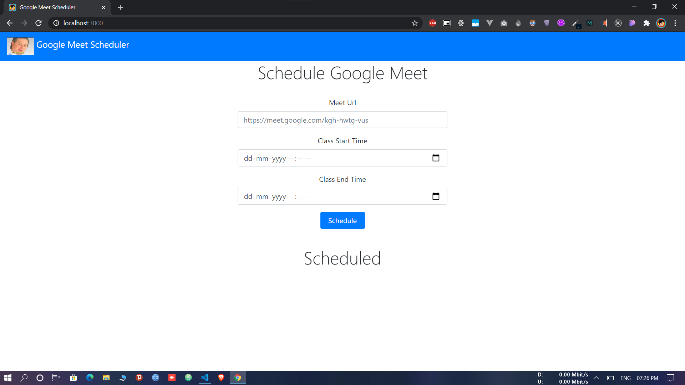

<h2 align="center">Google Meet Scheduler</h2>

<b>😴 Join's meet link for you</b>

Creates a headless browser and login with your gmail Id and password to join meet session.

### How to set up yours

1. Star this repo then fork it 😋
2. On line 14 and 15 in `server.js` add your email and password

You can now run this on your local machine.
Schedule and then leave it.

### Deployment

If you want Deploy your instance of app on Heroku

1. Create app on heroku
2. Push files on heroku
3. Add build
4. Commit and Push again

this video explains deployment on heroku very well 👉🏻 [YouTube Link](https://www.youtube.com/watch?v=Kl7mqpAK-bk)

Deploying on Heroku has some issue see [#1](https://github.com/AmanRaj1608/Google-Meet-Scheduler/issues/1)

 
 

---
